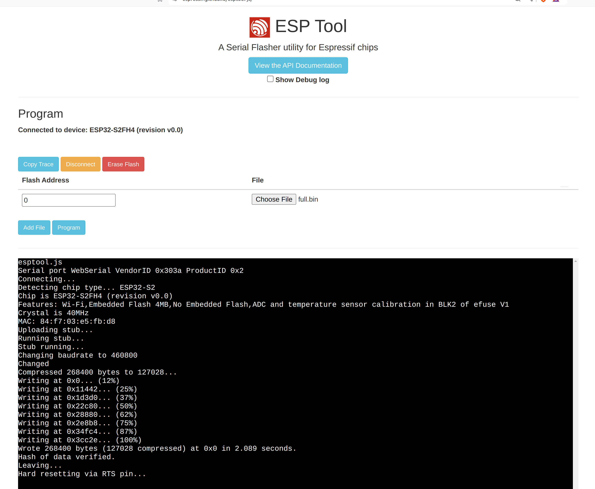

| Supported Targets | ESP32-S2 |
| ----------------- | -------- |

# Fruit Piano 

A simple 14 notes piano keyboard made from fruits.

Inspired by Makey Makey fruit piano with some improvements of having 14 notes (compare to 6),and playing with both hands without wearing any bracelets
Instead of using ADC in the ATmega32u4 like Makey Makey, this project utilize the built-in touch function and the advance touch processing of the affordable esp32s2 micro-controller.
Similar to the Makey Makey fruit piano this piano will act as a normal HID keyboard, and sending keystrokes to the computer, and a piano website or software on the computer will translate those keystrokes to notes of the piano.
Fruit piano at Ha Giang science fair 2023:

## Keymap
This keymap based on notes from the [Online Pianist's virtual piano](https://www.onlinepianist.com/virtual-piano).
| TOUCH CHANNEL | GPIO | Keystroke |
| ----------------- | -------- | -------- |
| TOUCH_PAD_1| GPIO_1| Q |
| TOUCH_PAD_2| GPIO_2| W |
| TOUCH_PAD_3| GPIO_3| E |
| TOUCH_PAD_4| GPIO_4| R |
| TOUCH_PAD_5| GPIO_5| T |
| TOUCH_PAD_5| GPIO_6| Y |
| TOUCH_PAD_7| GPIO_7| U |
| TOUCH_PAD_8| GPIO_8| I |
| TOUCH_PAD_9| GPIO_9| O |
| TOUCH_PAD_10| GPIO_10| P |
| TOUCH_PAD_11| GPIO_11| Z |
| TOUCH_PAD_12| GPIO_12| X |
| TOUCH_PAD_13| GPIO_13| C |
| TOUCH_PAD_14| GPIO_14| V |

### Hardware Required

Any ESP-S2 board and dupont wires to connect the fruits to the GPIO
In this case we use the [WEMOS S2 Mini](https://www.wemos.cc/en/latest/s2/s2_mini.html)
And standard Female to Male dupont wires

### Flashing firmware
Flashing can be done with any tools the supports ESP32 with the bin file from the release tag, this bin file has already contains bootloader, partition table and app so it should be flash at address **0x00**

You can use the [Online ESPTool](https://espressif.github.io/esptool-js/) to flash the firmware  

After successfully flashed the firmware like the upper picture, after reset the light on the kit will light up, signaling the firmware is running
